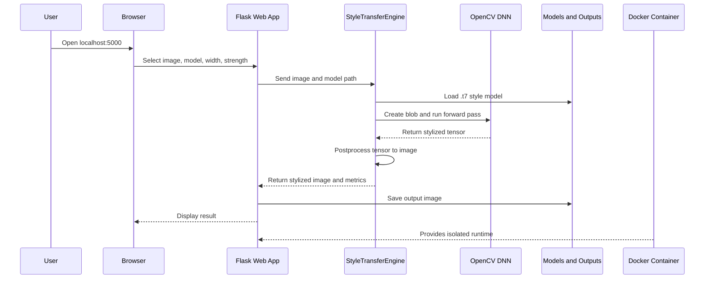

# Architecture Notes

## High-Level Flow



## Important Design Decisions

- The core logic is in `src/nst_opencv/processor.py` so both CLI and Flask use the same implementation.
- The Flask app is used for the browser-based demonstration.
- Docker is used for deployment so the evaluator can run the same environment on any Docker-supported machine.
- The CLI is useful for reproducible demos and report screenshots.
- Models are stored outside source code in the `models` folder because model files are binary assets.
- The project uses pretrained models because training is outside the realistic scope of a CPU-only student demo.

## Data Flow

```text
Input image
  -> Flask upload or sample selection
  -> OpenCV BGR matrix
  -> resized BGR matrix
  -> DNN blob with mean subtraction
  -> style network output tensor
  -> postprocessed BGR image
  -> saved/displayed stylized output
```

## Deployment Flow


## Key Files

- `app.py`: Flask user interface and HTTP routes.
- `Dockerfile`: Container image definition.
- `docker-compose.yml`: One-command deployment configuration.
- `src/cli.py`: Command line entry point.
- `src/nst_opencv/processor.py`: Style transfer engine.
- `scripts/download_models.py`: Model downloader.
- `docs/PROJECT_REPORT.md`: Submission report.
- `docs/VIVA_QUESTIONS.md`: Viva preparation.
