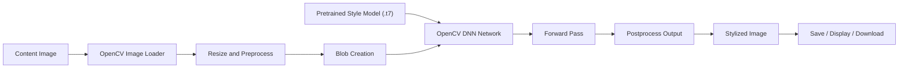

# Project Report: Neural Style Transfer with OpenCV

## Abstract

Neural Style Transfer is a computer vision technique that creates a new image by combining the content structure of one image with the visual style of another. This project implements fast neural style transfer using OpenCV's DNN module and pretrained Torch models. The system accepts a content image, applies a selected artistic style model, and generates a stylized image suitable for visual comparison and demonstration.

## Problem Statement

Traditional image filters apply fixed mathematical operations such as blur, sharpen, or color mapping. They do not understand high-level artistic patterns. Neural Style Transfer solves this limitation by using convolutional neural networks to transfer patterns such as brush strokes, color distributions, and texture from artistic styles while retaining the major objects and layout of the input image.

## Objectives

- Implement neural style transfer using Python and OpenCV.
- Use pretrained deep learning models for fast inference.
- Provide a simple CLI and Dockerized web interface.
- Generate side-by-side output for project demonstration.
- Prepare documentation for final-year CSE presentation and viva.

## Scope

The project focuses on image-based style transfer. It does not train new style models because training requires a large dataset, GPU resources, and longer experimentation time. The system instead uses pretrained models and demonstrates deployment, inference, preprocessing, and output visualization.

## Existing System

Basic image editing tools provide filters such as grayscale, sepia, and contrast adjustment. These filters modify pixels directly and cannot learn complex artistic features. Original neural style transfer methods based on Gatys et al. optimize the output image over many iterations, producing high-quality results but requiring more time.

## Proposed System

The proposed system uses fast feed-forward neural style transfer models. Each model is trained for one artistic style. During inference, the content image passes through the network once, producing a stylized output much faster than iterative optimization.

## Technology Stack

- Language: Python
- Computer Vision Library: OpenCV
- Deep Learning Inference: OpenCV DNN module
- Web Framework: Flask
- Deployment: Docker and Docker Compose
- Production Server: Waitress
- Image Processing: NumPy and Pillow
- Model Format: Torch `.t7`

## System Architecture

## Module Description

### 1. Image Input Module

The image input module reads content images from disk or from a Flask upload. Images are converted into OpenCV's BGR format for processing.

### 2. Preprocessing Module

The input image is resized to a selected width. It is then converted into a blob using `cv2.dnn.blobFromImage`. Mean pixel values are subtracted to match the preprocessing used by the pretrained model.

### 3. Neural Style Transfer Module

The selected `.t7` model is loaded with `cv2.dnn.readNetFromTorch`. OpenCV performs a forward pass and generates a transformed image containing the selected artistic style.

### 4. Postprocessing Module

The network output is reshaped, mean pixel values are added back, pixel values are clipped to the range 0 to 255, and the result is converted into an image.

### 5. Output Module

The final stylized image is saved in the `outputs` folder. The CLI can also generate a comparison image that places the original and stylized output side by side.

### 6. Docker Deployment Module

The Docker deployment module packages the Flask app, OpenCV dependencies, model files, and source code into a container. `docker-compose.yml` maps the application to port `5000` so the project can be demonstrated from a browser.

## Algorithm

1. Start.
2. Select a content image.
3. Select a pretrained style model.
4. Read image using OpenCV.
5. Resize image to the selected width.
6. Create an input blob with mean subtraction.
7. Load the `.t7` model using OpenCV DNN.
8. Pass the blob through the network.
9. Reshape and postprocess the output.
10. Save and display the stylized image.
11. Serve the web app through Docker on port `5000`.
12. Stop.

## Expected Output

The system produces an output image where the original image's objects and layout are visible, but colors, textures, and brush-like patterns come from the selected style model.

## Advantages

- Faster than optimization-based neural style transfer.
- Runs on CPU for normal project demonstrations.
- Uses OpenCV, a widely used computer vision library.
- Simple interface for non-technical users.
- Dockerized deployment reduces environment setup problems.
- Modular code that can be extended to video style transfer.

## Limitations

- Each pretrained model supports only one fixed style.
- Output quality depends on the selected model and input resolution.
- CPU inference can still be slow for very large images.
- The system does not train new styles.

## Future Enhancements

- Add webcam or video style transfer.
- Add GPU acceleration where supported.
- Add batch processing for multiple images.
- Train a custom style model using a selected painting.
- Add quantitative evaluation using perceptual similarity metrics.

## Conclusion

This project demonstrates how deep learning models can be integrated into a practical computer vision application using OpenCV. It shows the full workflow of loading images, preprocessing data, running neural network inference, and producing stylized visual outputs suitable for a final-year CSE project demonstration.
